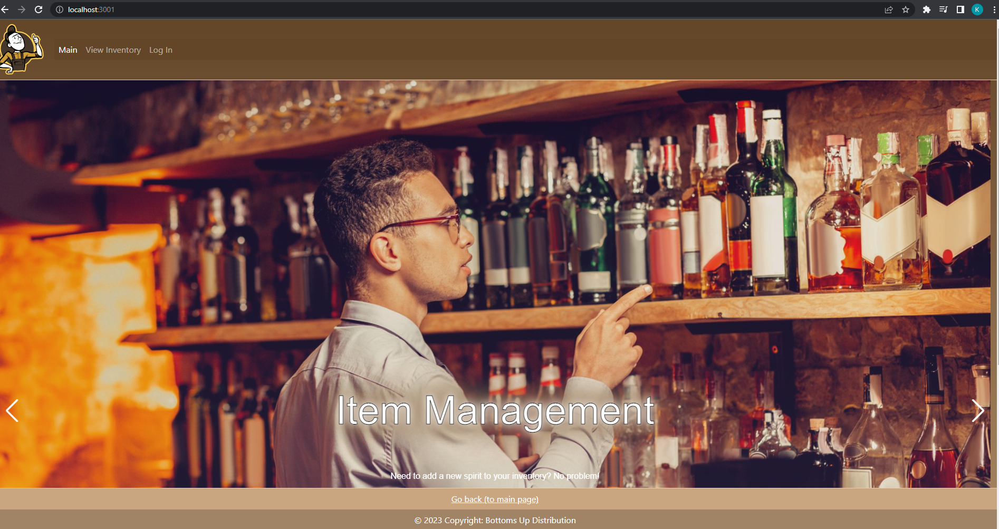
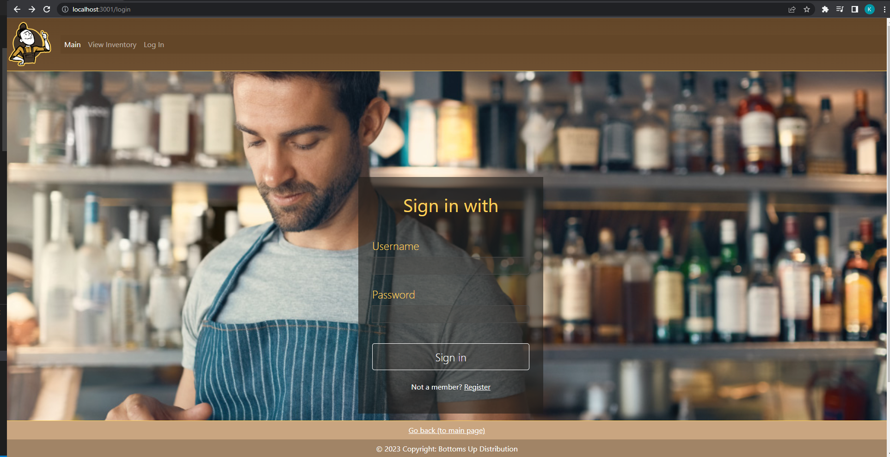
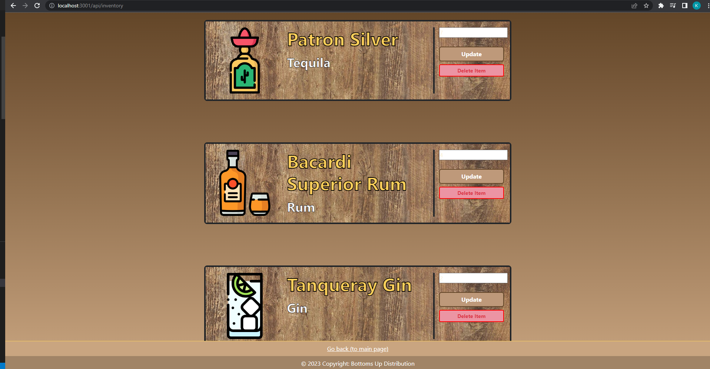
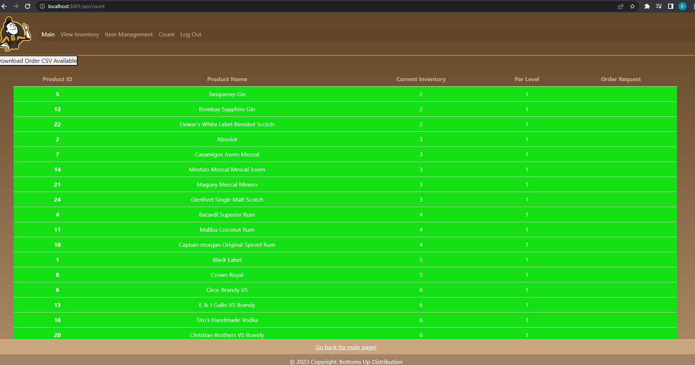

# Bottoms-up Inventory
   

  
  
   ## User Story
   *As an owner of a bar 

    *I want an app to easily manage inventory.
    *I want my employee be able to view, update the inventory.
    *I want my employee be able to view and export the result count as csv file.
    *I want the app automatically send alert email to me when the product is getting low.
    *I want the app automatically send an order request email to my supplier.
    *I want the admin level user to have the ability to delete a low demand product.
    *I want the admin level user to have the ability to register a new product.
    *I want the admin level user to have the ability to view inventoyr vs sales, to make smart decisions.

  
  ## Table-of-contents

* [Description](#Description)
* [Installation](#Installation)
* [Usage](#Usage)
* [Contributing](#Contributing)
* [Tests](#Tests)

 ## [License](#table-of-contents)
Learn more about our [mit](https://choosealicense.com/licenses/mit) license. 

### [Description](#table-of-contents)
In this application we where able to satisfy the user's needs. When opening the app, you will be presented with the homepage, that will give you the option to view inventory, or log in. Only when you are logged in, will you be able to access the database to change the inventory. If the admin is logged in, they will be able to have additional features, such as delete items, and add items to the inventory. When the inventory is low, and email will be sent to the admin, notifying them of these changes. 

### [Installation](#table-of-contents)
To install this please make sure that all dependencies have been downloaded. Once all items have been downloaded, you should be able to run the project by running "npm run watch" in the terminal. Please make sure you add your own password to the .env folder.

### [Usage](#table-of-contents)
This app was designed for use on both mobile and desktop platforms. Navigation elements will be in the dropdown menu on smaller screens. For first time users, the option to register as a user will be presented at the bottom of the login screen. On the inventory screen, you will be able to export the depleted items to a CSV file. In the count inventory screen you will be able to alter the inventory by changing the quantity on hand. If the inventory is low, the admin will be notified via email. If you are logged in as the admin, you will see an additional navigation item listed as "item management". When in this screen you will be able to add inventory items by choosing a category, how many you have on hand, what the minimum par level will be, and the name of the item. When logged in, the logout icon should show in the navbar. When not logged in, the loggin button should show. 

  

## View our deployed application on [Heroku](https://bottoms-up-2023-app.herokuapp.com/) 

  
  

 
 
 
 

### [Contributing](#table-of-contents)
We are currently not accepting contributions to this project.

### [Tests](#table-of-contents)
To test this application, please add your own dummy data. The login information for the admin is located in the seeds file. If you wish, you may test the routes in insomnia. 

#### [Questions?](#table-of-contents)
Please contact us using the following links.

Follow us here at our [Github](https://github.com/zeebigbadkitty/Bottoms-Up) 

Email: kyle_albright@hotmail.com, kuangye869@gmail.com
